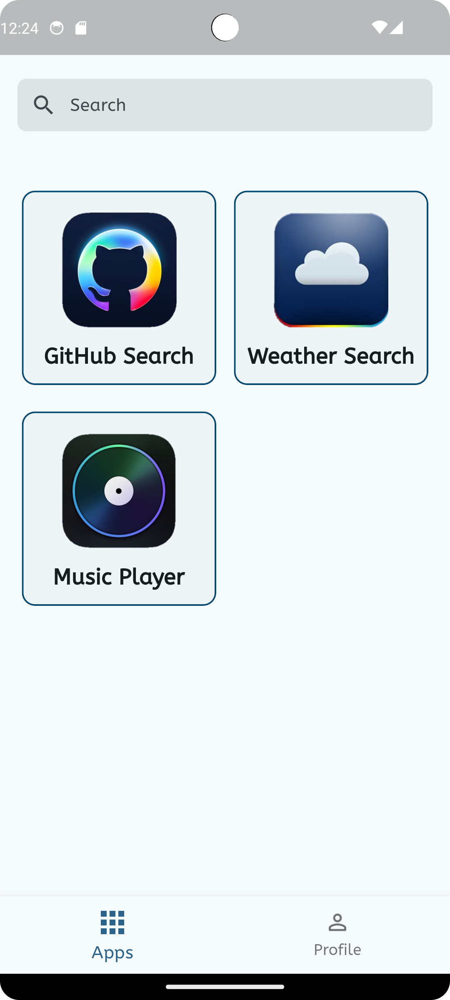
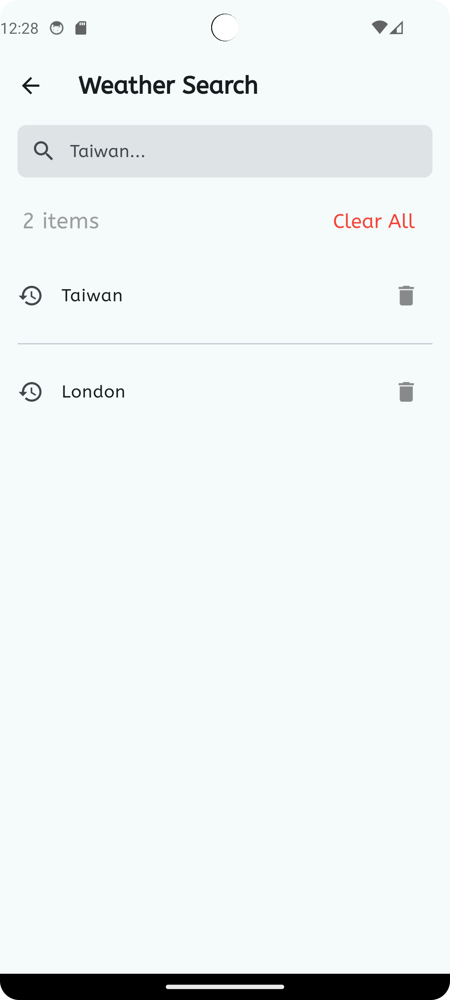
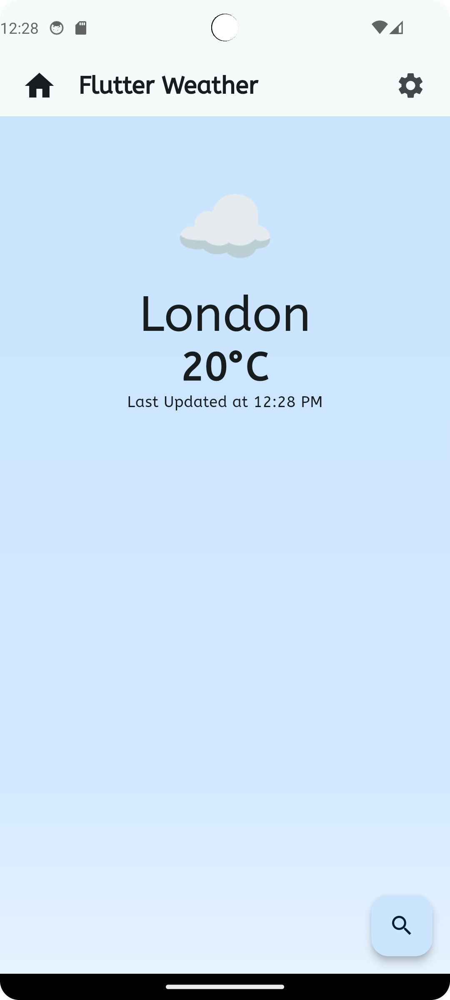
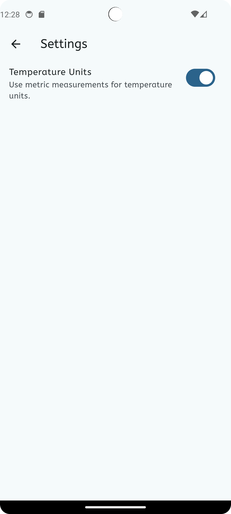
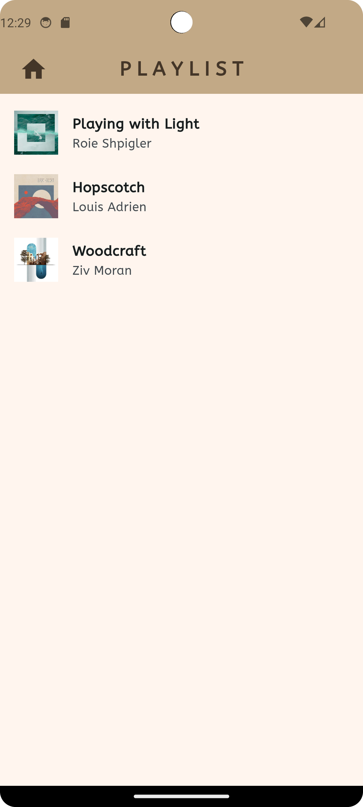
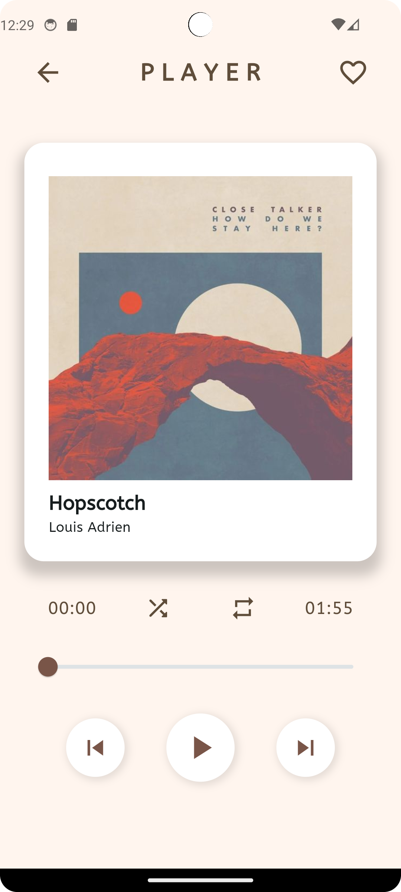
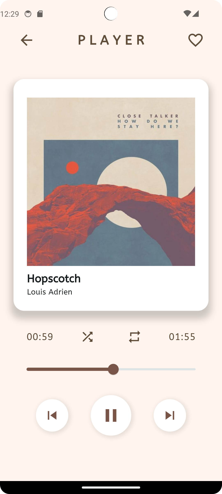

# flutter_magenta

## Introduction

This project consolidates my previous simple Flutter apps into one application.

## Features

- **GitHub Search** - Search for GitHub repositories.
- **Flutter Weather** - View weather information using a weather API.
- **Music Player** - simple music player, The player includes features for shuffle, repeat, play, pause, and seekable

## Screenshots

### GitHub Search



### Flutter Weather




### Music Player




## Installation

To get started with this project, follow these steps:

1. **Clone the repository:**

    ```bash
    git clone https://github.com/MagentaII/Flutter_Magenta.git
    ```

2. **Navigate to the project directory:**

    ```bash
    cd flutter_magenta
    ```

3. **Install dependencies:**

    ```bash
    flutter pub get
    ```

4. **Run the application:**

    ```bash
    flutter run
    ```
